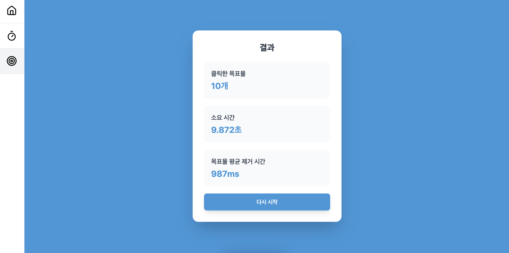

# SpeedCheck - 반응 속도 테스트 웹 애플리케이션

SpeedCheck는 사용자의 반응 속도와 정확도를 측정하는 웹 애플리케이션입니다. React와 TypeScript를 사용하여 개발되었으며, Vite를 통해 빠른 개발 환경을 제공합니다.

## 주요 기능

- 반응 속도 테스트
- 정확도 측정
- 실시간 결과 표시

## 페이지 구성

### 1. 홈 페이지


- 애플리케이션 소개
- 테스트 시작 버튼
- 최근 기록 표시

### 2. 반응 속도 테스트


- 시각적 자극에 대한 반응 시간 측정
- 실시간 결과 표시
- 평균 반응 시간 계산

### 3. 정확도 테스트



- 목표물 클릭 정확도 측정
- 시간 제한 내 정확도 점수
- 실시간 피드백

## 기술 스택

- React 18
- TypeScript
- Vite
- tailwindcss

## 시작하기

1. 저장소 클론

```bash
git clone https://github.com/kimdaeyeub/speedchecker
```

2. 의존성 설치

```bash
npm install
```

3. 개발 서버 실행

```bash
npm run dev
```

4. 빌드

```bash
npm run build
```

## 라이선스

MIT License
